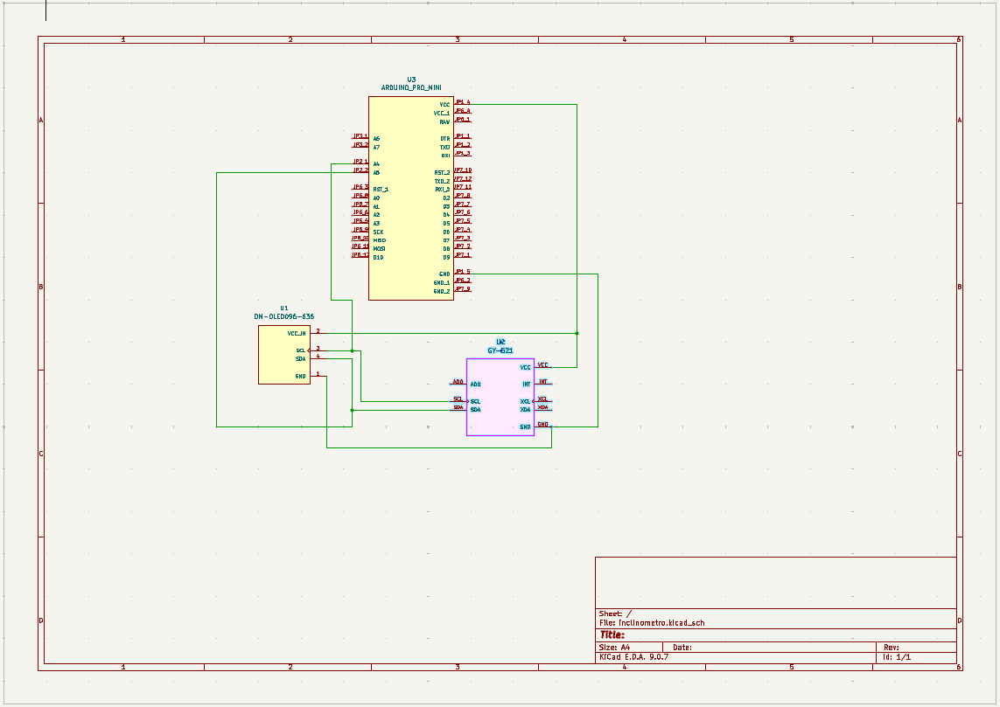

# Arduino HUD :bulb:

A simple Heads-Up Display (HUD) project for Arduino Pro Mini which visualices a MPU6050 gyroscope.

## Description :rocket:

A compact Heads-Up Display (HUD) for Arduino boards using a 128x32 OLED screen and the SSD1306 driver. It visualizes roll, pitch, and other flight-style metrics using a gyroscope (MPU6050). Designed for low RAM usage and optimized for small microcontrollers like the Arduino Pro Mini.

## Quick Start :rocket:

1. Connect the Arduino to your computer.
2. Download the Adafruit dependencies using the Arduino IDE. Also can be downloaded from here: (Adafruit_SSD1306)[https://github.com/adafruit/Adafruit_SSD1306/blob/master/examples/ssd1306_128x32_i2c/ssd1306_128x32_i2c.ino]
3. Open the Arduino IDE and load the "HUD.ino" sketch.
4. Compile and upload the sketch to your Arduino board.
5. Connect the display to the Arduino following the wiring instructions in the "Connections.md" file.
6. Power on the Arduino and the HUD will start displaying information.

### Schemes and blueprints

How to connect all the system:

## Compilation Manual :gear:

To compile the Arduino HUD project, follow these steps:

1. Install the Arduino IDE from the official Arduino website (https://www.arduino.cc).
2. Open the "HUD.ino" sketch in the Arduino IDE.
3. Select the appropriate board and port from the Tools menu.
4. Click the "Verify" button to compile the code.
5. If there are no errors, you can proceed to upload the sketch to your Arduino board.

## How to Use :computer:

1. Make sure the Arduino and display are properly connected.
2. Power on the Arduino board.
3. The HUD will automatically display the default information.
4. Customize the HUD by modifying the code in the "HUD.ino" sketch.
5. Upload the modified sketch to the Arduino to see the changes.

### Example

## PCB

Image to the PCB scheme for building a more robust project and not use the prototyping breadboard.

3d recreadtion to the PCB construction.

## Contributors :sparkles:

Thanks to the following contributors who have helped make this project possible:

- [@Duxy1996](https://github.com/Duxy1996) 🦄

Feel free to contribute by submitting pull requests or reporting issues.
